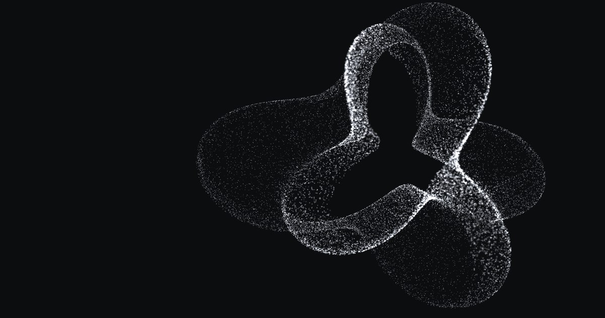

# sookie.me

My portfolio for web, graphics and XR work. Built with Next.js, React and TypeScript, with a Rust / wgpu particle renderer in the background.

[Live site](https://sookie.me/) · [English](https://sookie.me/en/) · [Deutsch](https://sookie.me/de/)

[](https://sookie.me/)

## Field / Form

Each page has its own particle shape. The same canvas stays behind the content as you navigate, keeping particle positions and velocities so a transition can change direction midway through.

The renderer uses WebGPU compute shaders for the simulation, with a WebGL2 fallback and static images for unsupported browsers. Mouse movement and scrolling affect the particles too.

[Try it](https://sookie.me/en/lab/field-form/) · [Rust renderer](graphics-rust/src/lib.rs) · [WGSL shader](graphics-rust/src/field.wgsl) · [Browser controller](src/graphics/controller.ts)

## Development

Node.js 24 and npm. The compiled WASM is included, so you can run the site without installing Rust.

```sh
npm ci
npm run dev
```

The dev server runs at `localhost:4321`. To build and preview the static site at `localhost:4416`:

```sh
npm run build
npm run preview
```

Page components live in [`src/content/pages/`](src/content/pages/). Korean, English and German copy lives in [`src/i18n/locales/`](src/i18n/locales/) and is rendered with `next-intl`.

See [Architecture and maintenance](docs/architecture.md) for tests, rebuilding the renderer and deployment.

## Credits and license

The visual references include the Pmndrs curl-noise example and Moon Kyungwon & Jeon Joonho’s _Phantom Garden_. Fonts are [Inter](public/documents/inter-LICENSE.txt) and [Pretendard](public/documents/pretendard-LICENSE.txt); icons are from [Phosphor](public/documents/phosphor-LICENSE.txt).

The independent Field / Form implementation is [MIT licensed](LICENSE). Project media, the résumé and third-party assets are not covered by that license.
